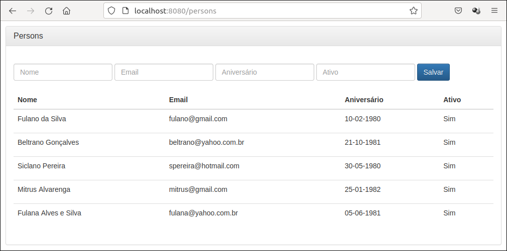

## About
The project shows how to build a web application using Spring Boot.

## Screenshots


## Technologies
The following technologies were used in this project:

* [Java Oracle](https://www.oracle.com/java/)
* [Apache Maven](https://maven.apache.org/)
* [Spring Boot](https://spring.io/projects/spring-boot)
* [Spring Data JPA](https://spring.io/projects/spring-data-jpa)
* [H2 Database](https://www.h2database.com/html/main.html)
* [Thymeleaf](https://www.thymeleaf.org/)
* [Spring Tools Suite](https://spring.io/tools)

## Testing the project
**Step 1:** Start the application using Spring Tools Suite.

**Step 2:** Access the application

```
http://localhost:8080/persons
```

## License
This project is under license from MIT. For more details, see the LICENSE file.
